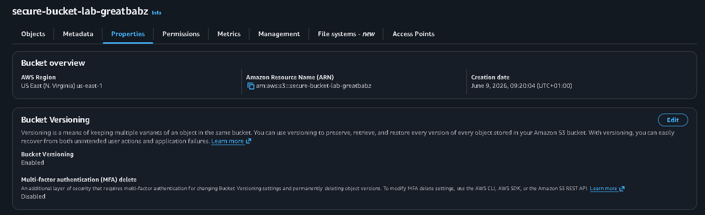
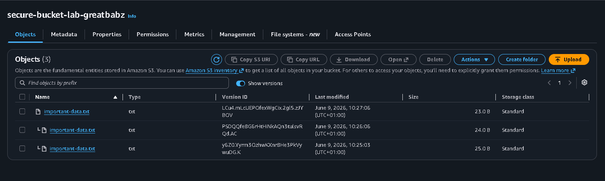
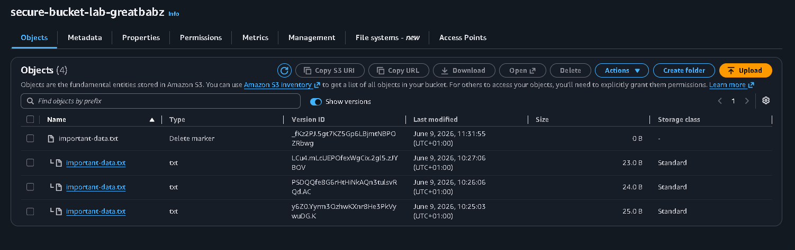
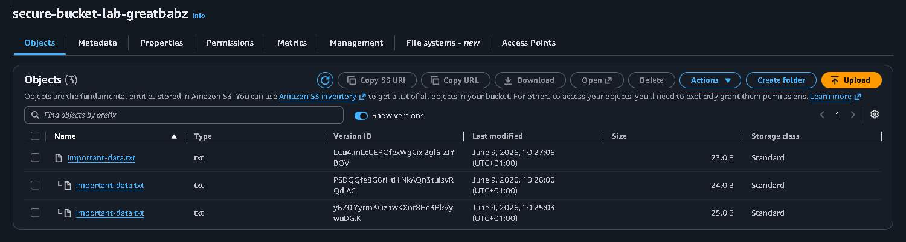
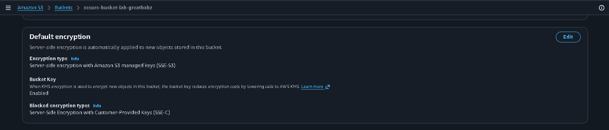
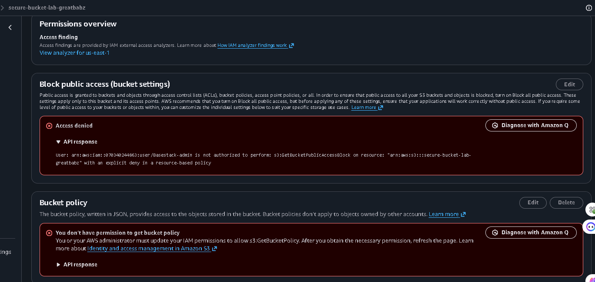

# 🔐 Week 5 · Day 3 — S3 Security & Access Control

> **S3 security best practices include versioning, encryption, and strict access control policies to protect cloud storage from accidental deletion, unauthorized access, and data loss.**

---

## 📋 Lab Objective

Secure an Amazon S3 bucket by enabling versioning, testing accidental deletion recovery, enabling server-side encryption, and applying bucket policies that restrict access to specific IAM roles.

---

## ✅ Prerequisites

- IAM admin access
- IAM role created previously
- AWS Management Console access

---

## 🏗️ Architecture Overview

```
S3 Bucket Created
        │
        ▼
Enable Versioning
        │
        ▼
Upload Multiple File Versions
        │
        ▼
Test Accidental Deletion Recovery
        │
        ▼
Enable SSE-S3 Encryption
        │
        ▼
Apply Bucket Policy
        │
        ▼
Restrict Access to Specific IAM Role
```

---

## 🛠️ What I Did

| Step | Action |
|------|--------|
| 1 | Created an S3 bucket named `secure-bucket-lab-greatbabz` |
| 2 | Enabled bucket versioning from the S3 Properties tab |
| 3 | Uploaded `important-data.txt` — Version 1 (original data) |
| 4 | Uploaded the same file again — Version 2 (updated data) |
| 5 | Uploaded the file a third time — Version 3 (latest data) |
| 6 | Enabled **Show versions** to verify all three versions were stored |
| 7 | Deleted `important-data.txt` to simulate accidental deletion |
| 8 | Verified that a **Delete Marker** was added while previous versions remained intact |
| 9 | Removed the Delete Marker to restore the latest version |
| 10 | Downloaded the restored file and confirmed successful recovery |
| 11 | Enabled **Server-Side Encryption (SSE-S3)** using Amazon S3 managed keys |
| 12 | Uploaded a new object and verified encryption was automatically applied |
| 13 | Navigated to Bucket Permissions and created a custom bucket policy |
| 14 | Configured the policy to deny all users except a specific IAM role |
| 15 | Tested access restrictions and confirmed unauthorized users were denied |
| 16 | Captured screenshots of all configurations |

---

## ☁️ AWS Resources Created

| Resource | Name | Details |
|----------|------|---------|
| S3 Bucket | `secure-bucket-lab-greatbabz` | us-east-1 |
| Object File | `important-data.txt` | Multiple versions |
| Bucket Policy | `DenyAllExceptRole` | IAM role restriction |
| Encryption Type | SSE-S3 | Amazon S3 managed keys |

---

## 📂 S3 Versioning

### File Version History

| Version | Content |
|---------|---------|
| Version 1 | Original data |
| Version 2 | Updated data |
| Version 3 | Latest data |

---

## ♻️ Accidental Deletion Recovery

### Recovery Workflow

```
Delete File
    │
    ▼
Delete Marker Added
    │
    ▼
Older Versions Still Exist
    │
    ▼
Delete the Delete Marker
    │
    ▼
Latest File Restored
```

### Recovery Results

| Test | Result |
|------|--------|
| File deleted from normal view | ✅ |
| Older versions preserved | ✅ |
| Delete marker detected | ✅ |
| File restored successfully | ✅ |
| Latest version recovered | ✅ |

---

## 🔒 Server-Side Encryption (SSE-S3)

| Setting | Value |
|---------|-------|
| Encryption Type | SSE-S3 |
| Key Type | Amazon S3 Managed Keys |
| Encryption Scope | Default bucket encryption |

| Check | Status |
|-------|--------|
| Default encryption enabled | ✅ |
| Newly uploaded objects encrypted | ✅ |
| SSE-S3 visible in object properties | ✅ |

---

## 🛡️ Bucket Policy Configuration

**Objective:** Restrict bucket access so that only a specific IAM role can interact with the bucket.

### Policy Logic

```
IF User ARN ≠ Approved IAM Role
THEN Deny Access
```

| Policy Feature | Description |
|----------------|-------------|
| Effect | Deny |
| Principal | All Users |
| Exception | Specific IAM Role |
| Actions Restricted | `s3:*` |
| Resource Scope | Bucket and Objects |

---

## 🔑 Security Features Implemented

| Feature | Purpose |
|---------|---------|
| Versioning | Protects against accidental deletion |
| Delete Marker Recovery | Enables object restoration |
| SSE-S3 Encryption | Encrypts data at rest |
| Bucket Policy | Restricts unauthorized access |
| IAM Role Restriction | Implements least privilege access |

---

## 📸 Screenshots

### 1. Bucket Versioning Enabled

*Bucket versioning set to Enabled in the Properties tab of `secure-bucket-lab-greatbabz`*

---

### 2. All Three Versions Visible

*Show versions toggle reveals all three uploads of `important-data.txt` with unique Version IDs*

---

### 3. Delete Marker Added After Deletion

*After deleting the file, a Delete Marker appears at the top while the previous versions remain intact*

---

### 4. File Restored After Removing Delete Marker

*Once the Delete Marker is removed, the latest version of `important-data.txt` is fully restored*

---

### 5. SSE-S3 Encryption Enabled

*Default encryption configured as Server-Side Encryption with Amazon S3 Managed Keys (SSE-S3)*

---

### 6. Bucket Policy Applied

*Bucket policy successfully applied — the `Basestack-admin` user is explicitly denied, confirming the IAM role restriction is working*

---

## 🎁 Bonus Challenge — MFA Delete

Enable MFA Delete via AWS CLI to prevent unauthorized permanent deletion of object versions.

| Feature | Benefit |
|---------|---------|
| MFA Protection | Prevents unauthorized deletion |
| Ransomware Defense | Protects critical backups |
| Version Security | Requires MFA for permanent deletion |

---

## 🧠 Key Takeaways

| Concept | Importance |
|---------|------------|
| S3 Versioning | Prevents permanent accidental deletion |
| Delete Marker | Enables recovery of deleted objects |
| SSE-S3 Encryption | Protects stored data automatically |
| Bucket Policies | Enforces secure access control |
| IAM Role Restriction | Limits access to authorized services only |
| Defense in Depth | Combines multiple security layers |

---

## 🐛 Troubleshooting

| Problem | Solution |
|---------|----------|
| Versioning not showing | Refresh bucket and enable "Show versions" |
| File not restored | Delete the delete-marker object |
| Encryption not visible | Upload a new object after enabling SSE-S3 |
| Bucket policy blocks all access | Add your IAM ARN as an exception |
| Access denied unexpectedly | Verify IAM role ARN is correct |

---

## 🗂️ Folder Structure

```
Week5-Day3-S3-Security/
├── README.md
└── screenshots/
    ├── S3-bucket-with-versioning-enabled.png
    ├── Show-versions-toggle-showing-all-3-versions.png
    ├── File-disappears-after-delete_delete-marker-added_.png
    ├── File-restored-after-removing-delete-marker.png
    ├── File-properties-showing-SSE-S3-encryption.png
    └── Bucket-policy-applied-in-console.png
```

---

## ⚠️ Cleanup

> Delete resources after the lab to avoid unnecessary AWS charges.

1. Open Amazon S3 Console
2. Delete all object versions
3. Remove delete markers
4. Delete the bucket policy
5. Delete the S3 bucket

---

## 📚 Resources

- [AWS S3 Versioning Documentation](https://docs.aws.amazon.com/AmazonS3/latest/userguide/Versioning.html)
- [AWS S3 Encryption Documentation](https://docs.aws.amazon.com/AmazonS3/latest/userguide/serv-side-encryption.html)
- [AWS Bucket Policy Documentation](https://docs.aws.amazon.com/AmazonS3/latest/userguide/bucket-policies.html)
- [AWS IAM Roles Documentation](https://docs.aws.amazon.com/IAM/latest/UserGuide/id_roles.html)

---

## ✍️ Author

**Oluwatoba Babalola**  
AWS Cloud Accelerator Program  
GitHub: [@Greatbabz](https://github.com/Greatbabz)

---

*Last Updated: June 2026 · Region: us-east-1*
